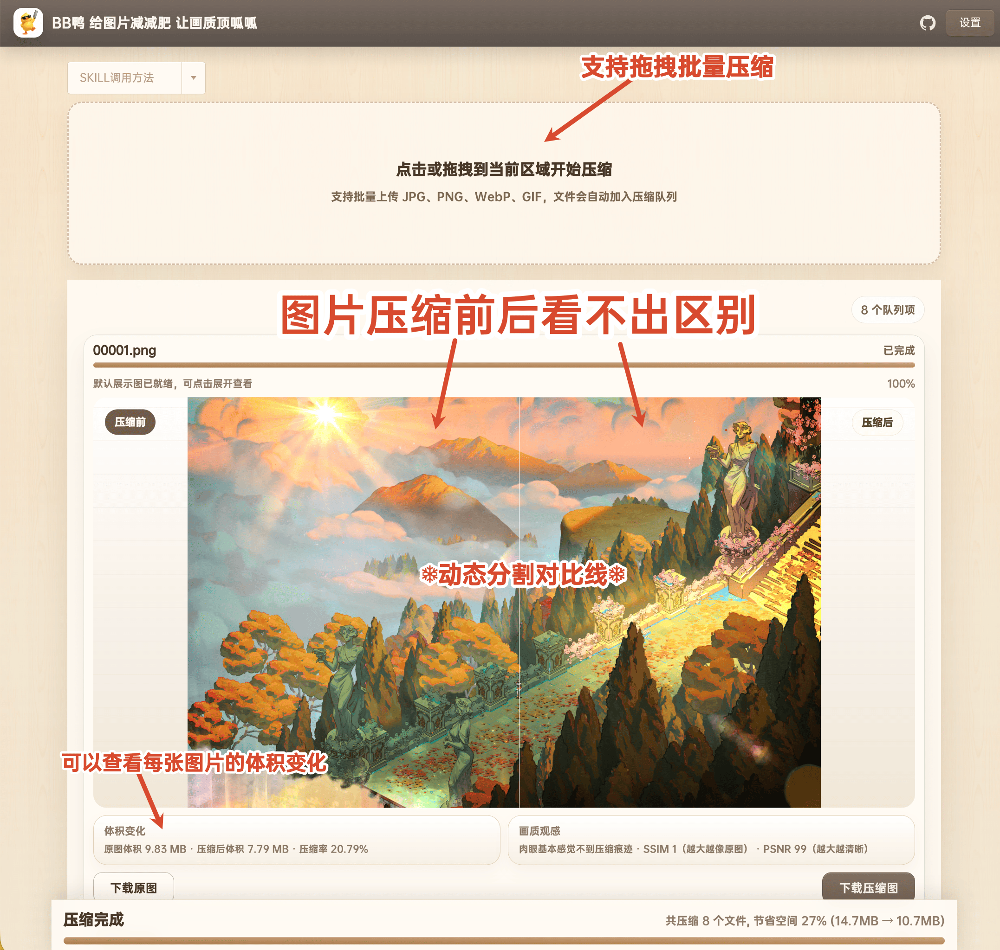
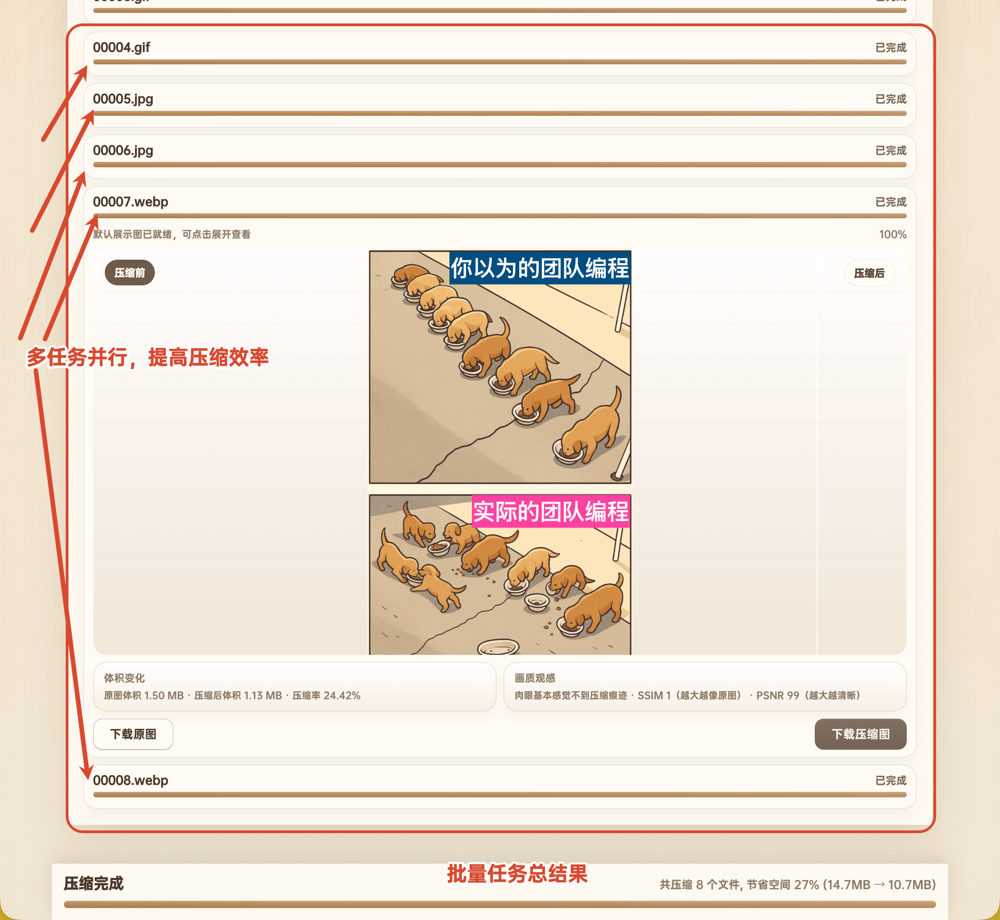
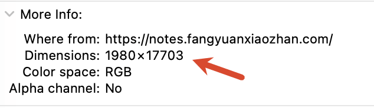
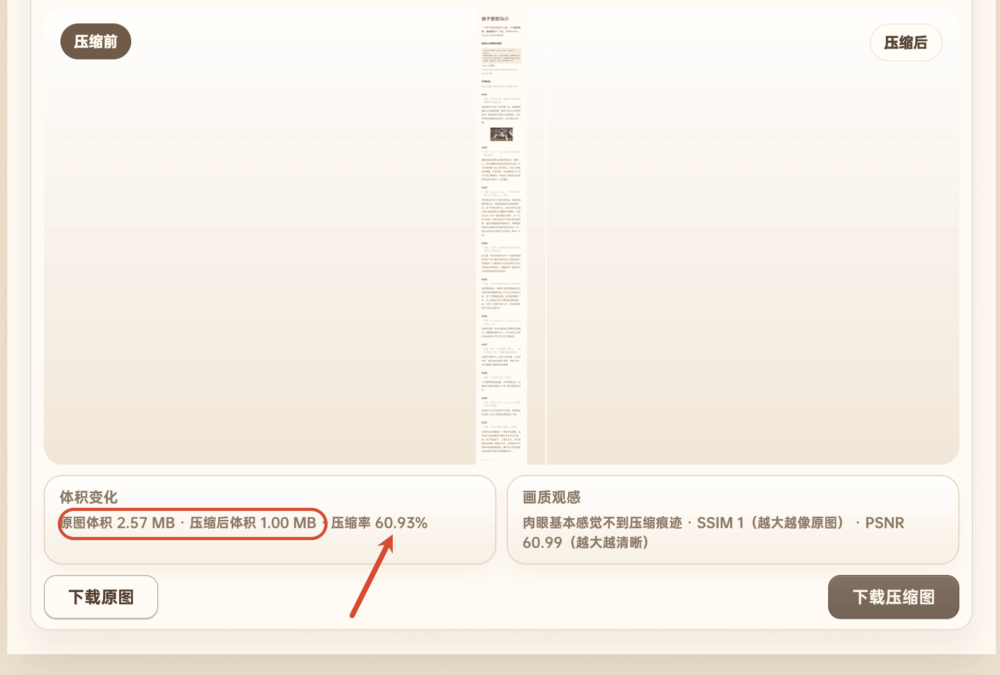
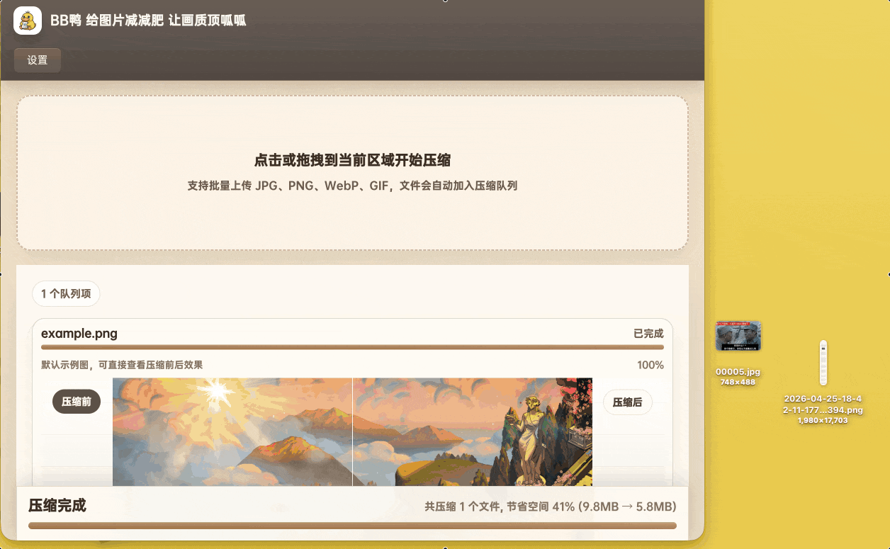
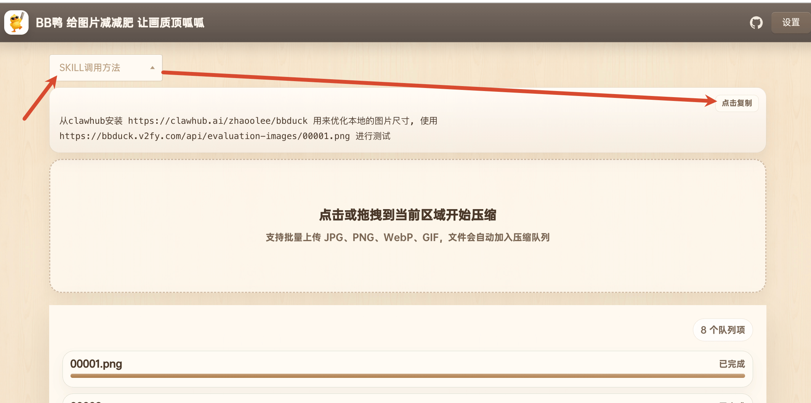
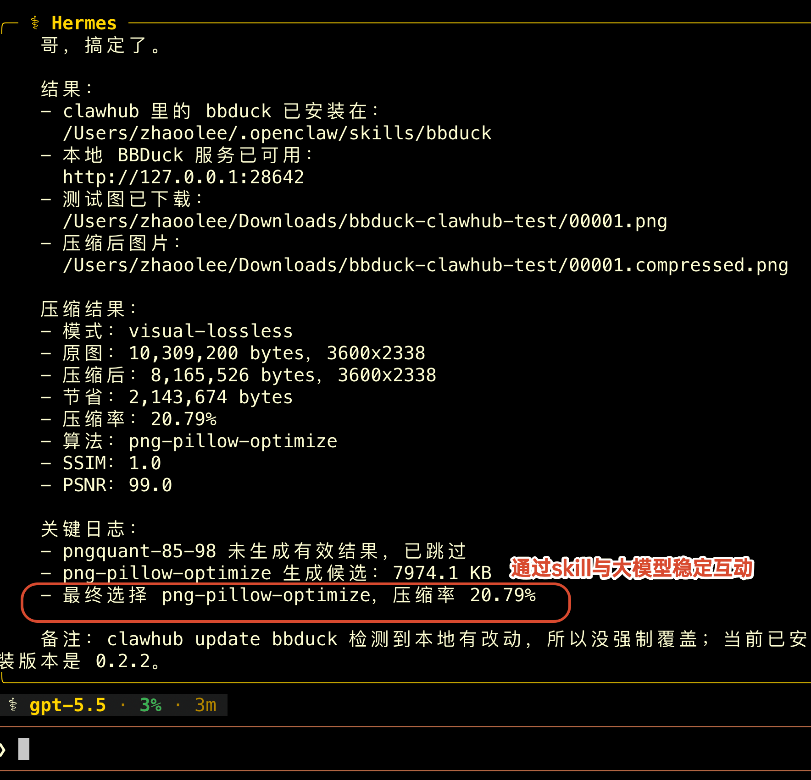

# BBDuck


BBDuck 是面向开源社区的图片压缩工具，以“视觉无损优先”为产品亮点，开源版 PP鸭，支持 skill 调用。


**开源地址** https://github.com/zhaoolee/bbduck



**在线体验地址**：https://bbduck.v2fy.com/ （我的服务器CPU很弱，压缩的速度不够快，如果是私有化部署的机器，压缩速度会非常快）



压缩**1980 × 17703**的长便签后，文件体积减少了 **60.93%**，也就是压缩后只有原来的**四成左右**，但文字依然非常清晰







## 本地部署

```bash
docker run -d --restart unless-stopped --name bbduck -p 28642:8000 zhaoolee/bbduck:latest
```

打开 http://127.0.0.1:28642 即可使用。

## SKILL 调用方法

skill 地址：
https://clawhub.ai/zhaoolee/bbduck

可直接在 Hermes 中使用：

```text
从clawhub安装 https://clawhub.ai/zhaoolee/bbduck 用来优化本地的图片尺寸, 使用
https://bbduck.v2fy.com/api/evaluation-images/00001.png 进行测试
```



通过**Hermes**运行的效果（**OpenClaw**同理，不过Hermes排版更有品，我就用Hermes截图了）


